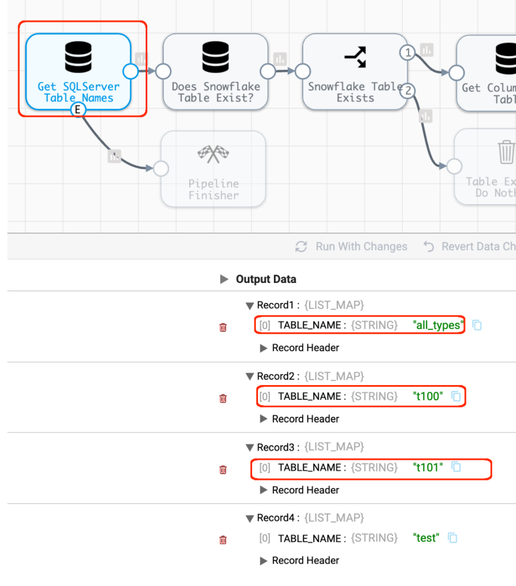

# create-snowflake-tables-from-sqlserver


## Overview

This project provides a [StreamSets Data Collector](https://streamsets.com/products/dataops-platform/data-collector/) (SDC) pipeline that generates CREATE TABLE statements for Snowflake tables in a target Snowflake schema that correspond to tables in a source SQLServer schema that do not already exist in the Snowflake schema.  The pipeline will write the statements to a file and can automatically execute them against Snowflake if desired. The pipeline does not move any data; it just generates and optionally executes CREATE TABLE statements against Snowflake. The CREATE TABLE statements will include PKs and NULL / NOT NULL properties and can optionally create [Transient](https://docs.snowflake.com/en/user-guide/tables-temp-transient.html#transient-tables) tables.

The pipeline creates tables using the same Column Data Type mapping from SQLServer to Snowflake that SDC uses

The pipeline differs from SDC's behavior in three ways:

- The pipeline will set PKs including composite PKs on the Snowflake tables to match the PKs in the SQLServer tables. 

- The pipeline will mark Snowflake columns as NOT NULL to match the nullability of the source SQLServer columns

- The pipeline can optionally create Transient tables

The pipeline does not set any constraints other than PKs; no unique or foreign key constraints are created (SDC does not create any of those constraints either)

All column lengths are set to max values, for example NUMBER columns will be set as NUMBER(38,0) and VARCHAR columns will be set as VARCHAR(16777216), just as SDC does.

The pipeline looks like this (a full sized image is [here](images/pipeline.png)):


## Import the Pipeline into Control Hub
The pipeline can be downloaded from [here](CreateSnowflakeTablesFromSQLServer.json) and imported into Control Hub.

## Pipeline Parameters

The pipeline takes the following parameters:


- Set the source SQLServer JDBC URL, database, and schema; and the target Snowflake JDBC URL, warehouse, database, and schema. 

- One can also specify SQLServer tables to exclude; if there is more than one, place each table name in single quotes, within a comma delimited string, like this: ````'systranschemas','table_3','table_4'````. 

- The ````OUTPUT_DIR```` specifies the directory where the CREATE TABLE script and all audit and errors will be written to.

- Set ````EXECUTE_SCRIPTS_ON_SNOWFLAKE```` to either true or false. A value of true will cause the pipeline to automatically execute the CREATE TABLE scripts against Snowflake


- Set ````CREATE_TRANSIENT_TABLES```` to either true or false.  A value of true will cause the pipeline to generate CREATE TRANSIENT TABLE statements rather than CREATE TABLE statements.


## Pipeline Configuration

- Load a Snowflake JDBC Driver into the JDBC stage (I recommend v3.12.17):


- Set SQLServer credentials in these three stages:


- Set Snowflake credentials in these two stages:


## Pipeline Walkthrough

- The pipeline starts by querying SQLServer for the list of non-excluded tables within the source schema:

	

- For each table, the pipeline queries Snowflake to see if a table of the same name exists in the target schema. If it does, a field named "TABLE_EXISTS" is added to the record:

	
	
- If the TABLE_EXISTS field exists and is set to "true" the record is ignored (sent to the Trash). If not, it continues down the pipeline.

- The next two stages query SQLServer for the list of columns and PK info. Here we can see the table t100 has two columns: ID which is an int NOT NULL and a PK, and NAME which is a varchar NULL:

	

- Once the column info is retrieved, a Jython stage is used to map the SQLServer data types to Snowflake data types (in the stage named "Map Types").  An init script is used to populate a dictionary that holds the type mappings when the pipeline starts:

````
# SQLServer to Snowflake Type Mapping
sdc.state['type_map'] = {}
sdc.state['type_map']['bigint'] = 'NUMBER'
sdc.state['type_map']['bit'] = 'BOOLEAN'
sdc.state['type_map']['decimal'] = 'NUMBER'
sdc.state['type_map']['int'] = 'NUMBER'
sdc.state['type_map']['money'] = 'NUMBER'
sdc.state['type_map']['numeric'] = 'NUMBER'
sdc.state['type_map']['smallint'] = 'NUMBER'
sdc.state['type_map']['smallmoney'] = 'NUMBER'
sdc.state['type_map']['tinyint'] = 'NUMBER'
sdc.state['type_map']['float'] = 'FLOAT'
sdc.state['type_map']['real'] = 'FLOAT'
sdc.state['type_map']['date'] = 'DATE'
sdc.state['type_map']['datetime2'] = 'TIMESTAMP_NTZ'
sdc.state['type_map']['datetime'] = 'TIMESTAMP_NTZ'
sdc.state['type_map']['datetimeoffset'] = 'TIMESTAMP_TZ'
sdc.state['type_map']['smalldatetime'] = 'TIMESTAMP_NTZ'
sdc.state['type_map']['time'] = 'TIME'
sdc.state['type_map']['char'] = 'VARCHAR'
sdc.state['type_map']['text'] = 'VARCHAR'
sdc.state['type_map']['varchar'] = 'VARCHAR'
sdc.state['type_map']['nchar'] = 'VARCHAR'
sdc.state['type_map']['ntext'] = 'VARCHAR'
sdc.state['type_map']['nvarchar'] = 'VARCHAR'
sdc.state['type_map']['binary'] = 'BINARY'
sdc.state['type_map']['image'] = 'BINARY'
sdc.state['type_map']['varbinary'] = 'BINARY'
````

- The Jython code replaces the SQLServer types in the column info with the Snowflake types

- One can see the column type mapping in preview mode:

	

- If a SQLServer type is encountered that is not included in the Jython dictionary, the All Types Mapped test will fail, and the record will be logged as having a mapping error:

	
	
- In the output directory, these errors will show up in files with names like this:

````MAPPING-ERROR_61f9a90f-8dfe-4e78-ab6a-9ba0615d4582.json````

with an error message like: 

````"TYPE_MAPPING_ERROR":"No type mapping exists for SQLServer type: smalldatetime"````

One can resolve such errors by adding entries to the Jython dictionary

- The "Generate Create Table Statement" stage is a Jython Evaluator that creates the Create Table statement that is sent to Snowflake (see the pipeline for the Jython script). The CREATE TABLE statements are written to a file:

	

- If the pipeline parameter ````EXECUTE_SCRIPTS_ON_SNOWFLAKE```` is set to true, the CREATE TABLE statements will be executed against Snowflake and the success or failure responses for each statement will be captured in separate "query success" and "query failure" logs:

	